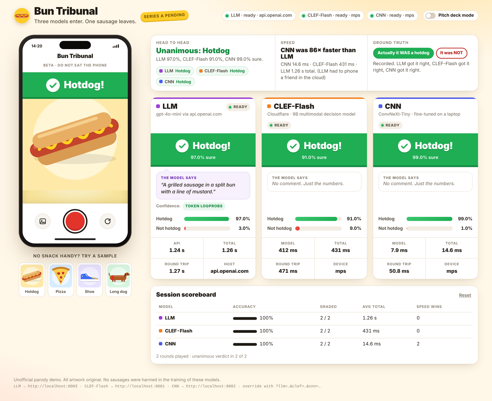

# Bun Tribunal 🌭

**Three very different AI models answer the most important question in computer vision: _hot dog or not hot dog?_**



| | Contender | What it is | Runs |
|---|---|---|---|
| 🟣 | **LLM** | A general-purpose vision chatbot asked for a verdict, a confidence and a one-line reason | via any OpenAI-compatible API: OpenAI, OpenRouter, or locally with Ollama / LM Studio |
| 🟠 | **CLEF-Flash** | Cloudflare's 9.4B decision model. It doesn't write text; it returns a probability per allowed answer | locally: a **4-bit MLX quantization** on Apple Silicon (~6 GB), the full BF16 weights elsewhere (~19 GB) |
| 🔵 | **CNN** | ConvNeXt-Tiny (28M params), fine-tuned on your laptop in ~20 min | locally |

Upload, drop, paste or snap a photo. All three judge it in parallel, and you get their verdicts, confidences and
speeds side by side, plus a session scoreboard once you tell it the truth.

## Quick start

```bash
./run.sh
```

That's it. The first run creates a Python environment, installs everything and walks you through setting up each
model (you can skip any of them), then starts the app and opens **http://localhost:8080**. Ctrl+C stops everything.

**Needs:** macOS or Linux and Python 3.11+ (e.g. `brew install python@3.12`). For CLEF-Flash: an Apple Silicon Mac
with 16 GB+ memory (4-bit MLX version) or an NVIDIA GPU with 24 GB+ (full model). The LLM and the CNN run fine on
smaller machines.

## Everything `run.sh` does

| Command | |
|---|---|
| `./run.sh` | Set up what's missing (it asks first), start everything, open the browser |
| `./run.sh llm` | Pick the LLM provider (OpenAI, OpenRouter, Ollama, LM Studio, other), enter a key, test it with one picture |
| `./run.sh train` | Train the CNN: download the data, fine-tune, evaluate, export. Shows live progress and writes an HTML report |
| `./run.sh download` | Download the CLEF-Flash weights: 4-bit MLX on Apple Silicon (~6 GB), full model elsewhere (~19 GB). Resumable |
| `./run.sh status` | What's set up and what's running (the three servers and the web app) |
| `./run.sh setup` | Ask again about everything that isn't set up yet (forgets earlier "skip" answers) |
| `./run.sh test` | All test suites (no keys or downloads needed) |
| `./run.sh help` | The commands and the environment settings below |

Settings go in front of the command, e.g. `PORT_UI=9090 ./run.sh`:

| Setting | For | |
|---|---|---|
| `LAN=1` | start | Also serve your Wi-Fi, to try it on your phone (the address is printed). Anyone on that network can then use it, and your LLM key, so only do this on networks you trust |
| `PORT_UI=9090` | start | Web app port, if 8080 is taken |
| `NO_BROWSER=1` | start | Don't open the browser |
| `DEVICE=mps\|cuda\|cpu` | train, start | Force a PyTorch device (CNN, and CLEF-Flash with the torch backend) |
| `ARCH=…`, `ADD_FOOD101=0`, `DATA_SOURCE=kaggle` | train | CNN training options, see [cnn/README.md](cnn/README.md) |
| `CLEF_BACKEND=mlx\|torch` | download, start | Which CLEF-Flash weights to download and run |
| `NONINTERACTIVE=1` | any | Never ask; take the defaults |
| `FORCE_INSTALL=1` | any | Reinstall the Python packages |
| `PYTHON=python3.12` | any | Which Python creates `.venv/` |
| `NO_COLOR=1` | any | Plain output |

A model that isn't set up yet doesn't break anything. Its card says **not set up** and shows the exact command that
fixes it, and the other models keep working. If a provider has a hiccup, every card has a **Retry** button.

## The three contenders in a bit more detail

**LLM** (`llm-server/`). It sends the picture with a strict definition: a sausage in a bun, so no corn dogs and no
dachshunds. If the API returns token probabilities (OpenAI does), the confidence comes from the model's actual token
distribution; otherwise it's the number the model states itself, and the card marks it as "self-reported".
Rate limits and overloaded providers are retried automatically. Reasoning models get extra room to think.
→ [llm-server/README.md](llm-server/README.md)

**CLEF-Flash** (`clef-server/`). Cloudflare's [CLEF-Flash](https://huggingface.co/Cloudflare/clef-flash), asked one
typed question with the options `hotdog` / `not_hotdog`, each with a short description. On a Mac it runs
[`mlx-community/clef-flash-4bit`](https://huggingface.co/mlx-community/clef-flash-4bit), a **4-bit quantized MLX
version** of the model: a third of the size of the full BF16 weights, fast on the Apple GPU, with slightly less precise
probabilities. Elsewhere it runs the full model with PyTorch (`CLEF_BACKEND=torch` forces that on a Mac too). Edit
`clef-server/clef_schema.json` to change the question. → [clef-server/README.md](clef-server/README.md)

**CNN** (`cnn/`). An ImageNet-pretrained ConvNeXt-Tiny, fine-tuned on hot dogs and look-alike dishes (fries, tacos,
prime rib …) from [Food-101](https://data.vision.ee.ethz.ch/cvl/datasets_extra/food-101/), a free download that needs no
account. It is tested on 500 images from Food-101's separate test split. A run on Kaggle's SeeFood set, which is cut from
Food-101 the same way, scored **94 % accuracy on 500 held-out test images** (precision 0.99, recall 0.89, ROC-AUC 0.99),
with calibrated confidences, in about 20 minutes on an Apple Silicon Mac.
The notebook `cnn/train_hotdog_cnn.ipynb` explains every step and shows Grad-CAM heatmaps of what the model looks
at. → [cnn/README.md](cnn/README.md)

**Web app** (`ui/`). Static HTML/CSS/JS, no build step. → [ui/README.md](ui/README.md)

## Project layout

```
run.sh            the one script
ui/               the web app, port 8080
llm-server/       LLM contender, port 8003
clef-server/      CLEF-Flash contender, port 8001
cnn/              training notebook + CNN server, port 8002
scripts/          small helpers used by run.sh
CONTRACT.md       the JSON API all three servers share
requirements.txt  every Python package run.sh installs (pulls in each component's requirements.txt)
pyproject.toml    developer tooling config (ruff, pytest)
docs/             screenshot
LICENSE           MIT
```

Local state that is never committed: `.venv/` (Python packages), `llm-server/.env` (your LLM settings and key; the
previous version is kept as `.env.bak`), `cnn/artifacts/` (your trained model and training report), `cnn/data/`
(datasets), `logs/` (server logs), `.run-prefs` (remembered "skip" answers). The CLEF-Flash weights go to the
Hugging Face cache (`~/.cache/huggingface`, or `HF_HOME`).

## Development

`./run.sh test` runs the pytest suites of `clef-server/`, `cnn/` and `llm-server/`; none needs a key, a download or a
GPU. Lint and format settings for [ruff](https://docs.astral.sh/ruff/) live in `pyproject.toml` (ruff is not installed
by `run.sh`):

```bash
pip install ruff
ruff check . && ruff format --check .
```

## Troubleshooting

- **"Port 8080 is already in use"**: Bun Tribunal is probably still running in another terminal. If another app
  owns 8080, use `PORT_UI=9090 ./run.sh`.
- **Changed the LLM settings?** Restart `./run.sh` so the LLM server picks them up.
- **A card says "not set up"**: run the command it shows, then restart `./run.sh`.
- **Something crashed**: `run.sh` prints the last lines of the log; full logs are in `logs/`.
- **Skipped a model's setup and want it back**: `./run.sh setup` asks again for everything that's missing.

## License

The code in this repository is released under the [MIT License](LICENSE).

It does not cover the models and data the project downloads, which keep their own terms:
[CLEF-Flash](https://huggingface.co/Cloudflare/clef-flash) and its
[4-bit MLX version](https://huggingface.co/mlx-community/clef-flash-4bit) (both Apache-2.0), the ImageNet-pretrained torchvision weights,
[Food-101](https://data.vision.ee.ethz.ch/cvl/datasets_extra/food-101/), the optional Kaggle
[SeeFood dataset](https://www.kaggle.com/datasets/dansbecker/hot-dog-not-hot-dog), and the LLM provider you connect.
The UI is an unofficial parody; all of its artwork is original.
